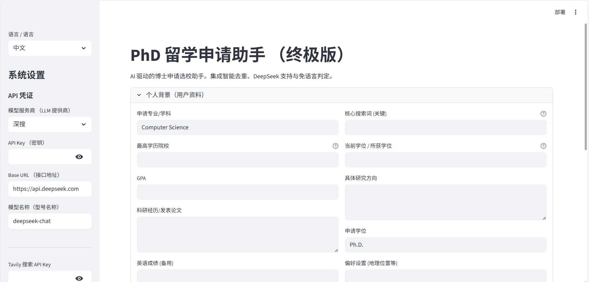

# PhD-Scout：用于博士项目筛选的 AI 助手

[🇺🇸 English](README.md) | [🇨🇳 中文说明](README.zh-CN.md)

<a name="chinese"></a>

中文说明 (Chinese)

PhD-Scout 是一款 AI 驱动的工具，旨在简化博士项目申请初期的筛选和评估流程。
它专注于解决三个通常需要大量人工操作的核心任务：

识别与申请者研究背景高度匹配的博士项目
验证关键录取要求（例如是否接受 Duolingo 英语测试）
确认奖学金资助政策及其他硬性条件
该工具最初是为了辅助我本人申请美国计算机科学博士项目而开发，现作为开源项目发布，希望帮助面临类似挑战的申请者。

# 背景与动机
在申请博士项目的过程中，申请人往往需要花费大量时间处理以下问题：

教授的研究简介分散在各院系网站，难以系统整理
各校对英语成绩（如 Duolingo）的要求表述不一，甚至隐藏在网页中
奖学金政策因学校和项目而异，信息不易获取
缺乏可靠指标判断与教授研究方向的匹配度
手动比较几十甚至上百个项目的效率极低
传统的排名（如 US News）对博士申请的实际研究匹配帮助有限。
PhD-Scout 的目标是自动化“初步筛选”阶段，让申请人能聚焦于高质量的候选项目，从而更高效地撰写有针对性的个人陈述（SOP）。

# 核心功能
## 1. 混合式项目发现
支持手动指定目标学校，同时基于你的背景（GPA、发表论文、研究关键词）由 AI 推荐潜在匹配的项目。

## 2. 研究方向匹配度分析
*   **双源验证**：结合 Tavily (谷歌搜索) 查询招生官网信息，并集成 **Semantic Scholar API** 深入检索学术论文。
*   **智能打分**：LLM 自动分析教授论文与你研究关键词的契合度，生成 0–100 的“适配评分”，并精准定位潜在导师。
*   **校友加成**：自动识别目标院校是否为你的母校/关联院校，并在评分系统中给予权重加成（可配置）。

## 3. 硬性条件自动验证
自动抓取项目官网信息，验证以下关键条件：

是否接受 Duolingo 英语测试（DET）
是否提供全额资助（Full Funding）
是否有明确的 GPA 或先修课要求
每项结论均附带原始网页链接，方便你人工复核。
## 4. 交互式 Web 界面（可选）
提供基于 Streamlit 的图形界面，便于配置输入、运行分析和导出结果。

## 5. 灵活可配置的架构
支持命令行（CLI）和图形界面（GUI）两种使用方式
可自定义大模型提供商（如 OpenAI、DeepSeek）
可替换搜索引擎（默认使用 Tavily API）
用户资料和目标项目列表可通过配置文件轻松修改
支持多种输出格式
技术栈
核心语言：Python
框架：LangChain
大模型支持：OpenAI GPT-4o、DeepSeek V3（可切换）
网络搜索：Tavily API
图形界面：Streamlit

## 界面预览

PhD-Scout 提供了一个直观的 Streamlit 仪表盘。你无需修改代码，即可在图形界面中轻松配置个人背景、申请策略和 API 密钥。


*(配置与设置面板)*

# 快速开始
## 1. 克隆仓库

 ```bash
git clone https://github.com/sunnyspot114514/PhD-Scout-AI-Agent-for-PhD-Program-Selection.git
cd PhD-Scout-AI-Agent-for-PhD-Program-Selection 
```

## 2. 安装依赖

```bash
pip install -r requirements.txt
```

## 3. 配置 API 密钥

先申请两个必要的API密钥：

* **DeepSeek API** :  
    https://platform.deepseek.com/api_keys
* **Tavily 网络搜索 API** (用于实时学校信息查询):  
    https://app.tavily.com/

然后，在项目根目录下创建 .env 文件，填入你的密钥：

# 大模型配置

```bash
LLM_API_KEY=your-key
LLM_BASE_URL=https://api.deepseek.com
LLM_MODEL_NAME=deepseek-chat
 ```

# 搜索工具

```bash
TAVILY_API_KEY=your-tavily-key
```

## 4. 运行工具

方式一：命令行（CLI）

编辑 config.yaml 文件，填写你的背景信息和目标学校
运行：

```python
python main.py
```

方式二：图形界面（GUI）

```python
streamlit run app.py
```

程序将在浏览器中打开：http://localhost:8501

# 输出示例


# 人机协同设计
在测试中我们发现：系统曾误判德克萨斯大学圣安东尼奥分校（UTSA）不接受DET成绩，只因该校信息藏在网页下拉菜单中，程序无法自动获取。

这提醒我们——AI能快速筛选信息，但关键决策必须人工核验。因此PhD-Scout每条建议都附带原始链接，请你在提交申请或缴费前，花10秒点开链接，亲自确认在正式提交申请或缴纳费用前，亲自核实所有关键信息。

# 后续计划
- [ ] 优化并行处理效率

- [x] 支持中英双语报告 (已完成)

- [x] Streamlit 图形化界面 (已完成)

- [x] 集成 Semantic Scholar 学术库 (已完成)

- [ ] 自动生成套磁信草稿

# 许可证
本项目采用 MIT 开源许可证。
详情请参阅 LICENSE 文件。


如果你是刚开始准备申请的“小白”，这个工具可以帮助你把精力集中在真正值得申请的项目上，而不是淹没在海量信息中。欢迎使用、反馈和贡献！