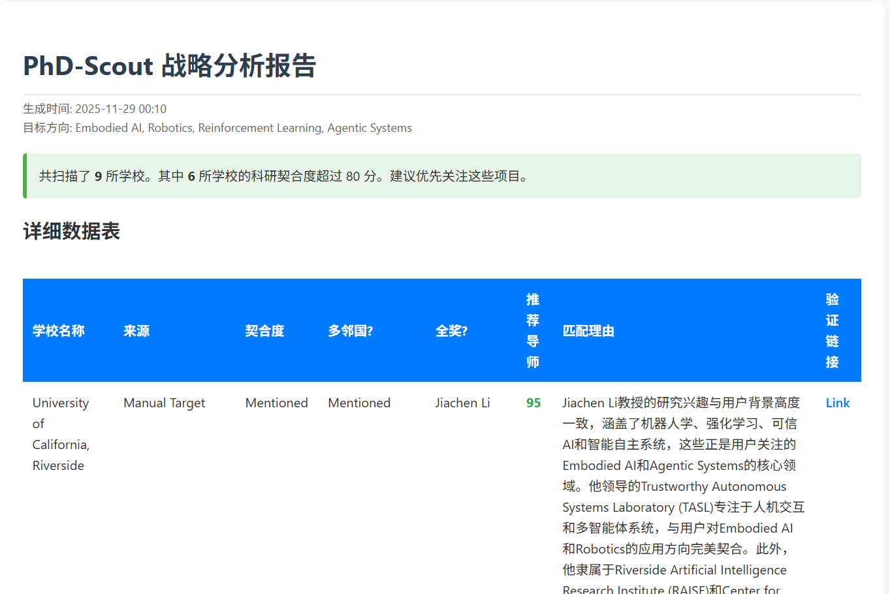

PhD-Scout: AI-Powered Research & Admission Agent

[🇺🇸 English](README.md) | [🇨🇳 中文说明](README.zh-CN.md)

中文说明 (Chinese)

为什么做这个工具？
我正在申请美国的计算机科学博士。整个过程要翻几百个实验室网站，特别重复又费时间。我发现，自己每天都在干这几件事：

查学校接不接受多邻国（Duolingo）——因为时间紧，不能考托福雅思；
找有没有全额奖学金（Full Funding）；
一个个看教授主页，找研究方向真正对得上的导师。
像 US News 这种排名，对博士申请基本没用。
所以我做了这个 AI 工具，自动完成前期“侦察”工作，让我能把精力放在写好真正值得投的 SOP 上。

主要功能
智能+手动结合推荐
你可以自己列目标学校，也能让 AI 根据你的 GPA、论文、兴趣，推荐可能适合你的“冷门宝藏”项目。
研究匹配打分（0–100 分）
用大模型分析教授的研究方向，算出你和他/她的匹配度，还会告诉你为什么匹配。
硬性条件自动查
自动爬官网，确认学校是否接受多邻国、是否保证全额资助等关键信息。
生成交互式 HTML 报告
运行完自动弹出一个网页报告：分数用颜色标出，每条结论都带官网链接，点一下就能核实。

用到的技术
核心：Python + LangChain
大模型：支持 DeepSeek-V3 或 GPT-4o（可配置）
网页搜索：Tavily API（实时抓取并整理网页内容）
报告生成：用 Pandas 处理数据，直接输出漂亮的 HTML 页面
快速开始
克隆项目

bash
12
git clone [https://github.com/sunnyspot114514/PhD-Scout-AI-Agent-for-PhD-Program-Selection.git](https://github.com/sunnyspot114514/PhD-Scout-AI-Agent-for-PhD-Program-Selection.git)
cd PhD-Scout-AI-Agent-for-PhD-Program-Selection

安装依赖

bash
1
pip install -r requirements.txt

配置 API 密钥
在根目录新建一个 .env 文件，填入你的密钥：

env
1234567
# LLM 配置（以 DeepSeek 为例）LLM_API_KEY=sk-你的密钥LLM_BASE_URL=https://api.deepseek.comLLM_MODEL_NAME=deepseek-chat# 搜索工具TAVILY_API_KEY=tvly-你的密钥

填写你的背景信息
编辑 config.yaml 文件，填上你的 GPA、研究兴趣、想申的学校等。

运行

bash
1
python main.py

程序跑完后，会自动生成 phd_report.html 并在浏览器里打开。

截图

“AI 辅助，人工确认”的设计原则
开发时我遇到一个例子：德州大学圣安东尼奥分校（UTSA）。
AI 一开始说“不接受多邻国”，因为官网信息藏在一个 JavaScript 下拉菜单里，爬虫没抓到。

这让我明白了一点：AI 只是帮你筛信息的工具，不能代替你做最终判断。

所以这个工具的设计原则是：

所有结论都附带原始链接（source_url），你可以一键点进去核实；
它帮你从几百个项目里快速找出最有可能的 10%，但最终是否申请，由你亲自确认。
适合像我一样时间紧、想高效申请 PhD 的人。
AI 负责干活，你负责决策。

Created by 

$$Sunny99$$

 - 2025 PhD Applicant